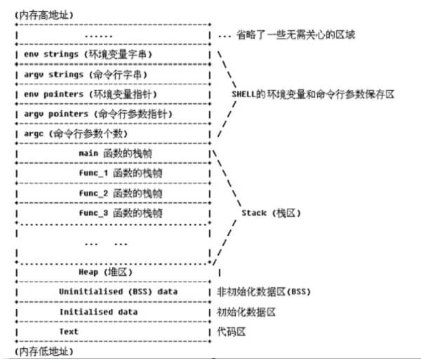

## 内存四区
- 代码区(.text)：这个区域存储着被装入执行的二进制机器代码，处理器会到这个区域取指令执行。
- 数据区(.data)：用于存储全局变量和静态变量等。
- 堆区：动态地分配和回收内存，进程可以在堆区动态地请求一定大小的内存，并在用完后归还给堆区。**地址由高到低生长**。
- 栈区：用于动态地存储函数之间的调用关系，以保证被调用函数在返回时恢复到母函数中继续执行；此外局部变量也存储在栈区。**地址由低到高生长**。

## 栈的概念
- 一种数据结构,数据存储方式为先进后出，压栈(push)和出栈(pop)。
- 每个程序都有自己的进程地址空间，进程地址空间中的某一部分就是该程序的栈，用于保存函数调用信息和局部变量。
- 程序的栈是从进程空间的高地址向低地址增长的,数据是从低地址向高地址存放的。
    