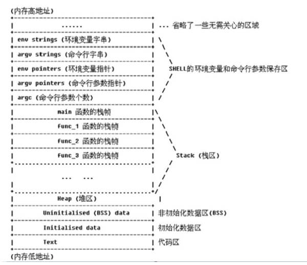

## 1.1 内存四区
- 代码区(.text)：这个区域存储着被装入执行的二进制机器代码，处理器会到这个区域取指令执行。
- 数据区(.data)：用于存储全局变量和静态变量等。
- 堆区：动态地分配和回收内存，进程可以在堆区动态地请求一定大小的内存，并在用完后归还给堆区。**地址由高到低生长**。
- 栈区：用于动态地存储函数之间的调用关系，以保证被调用函数在返回时恢复到母函数中继续执行；此外局部变量也存储在栈区。**地址由低到高生长**。

## 1.2 栈的概念
- 一种数据结构,数据存储方式为先进后出，压栈(push)和出栈(pop)。
- 每个程序都有自己的进程地址空间，进程地址空间中的某一部分就是该程序的栈，用于保存函数调用信息和局部变量。
- 程序的栈是从进程空间的高地址向低地址增长的,数据是从低地址向高地址存放的。
    

## 1.3 函数的调用
- 函数调用经常嵌套，在同一时刻，堆栈中会有多个函数的信息。

### 1.3.1 栈帧
- 每个未完成运行的函数占用一个独立的连续区域，称作栈帧。
    

### 1.3.2 基本流程

    ```nasm
    ;调用前
    push arg3               ;32位esp-4,64位esp-8
    push arg2
    push arg1
    call func               ;1. 压入当前指令的地址，即保存返回地址 2. jmp到调用函数的入口地址
    push ebp                ;保存旧栈帧的底部,在func执行完成后在pop ebp
    mov ebp,esp         ;设置新栈帧的底部
    sub esp,xxx         ;设置新栈帧的顶部
    ```


### 1.3.3 详细流程
```c
int func_b(int b1,int b2)
{
  int var_b1,var_b2;
  var_b1 = b1+b2;
  var_b2 = b1-b2;
  return var_b1 * var_b2;
}
int func_a(int a1,int a2)
{
  int var_a;
  var_a = fuc_b(a1+a2);
  return var_a;
}
int main(int argc,char** argv,char **envp)
{
  int var_main;
  var_main = func_a(4,3);
  return 0;
}
```

### 1.3.4 参数传递
- x86
> 1. 通过栈传参
> 2. 先压入最后一个参数
- x64
> 1. rdi rsi rdx rcx r8 r9 接收后六个参数
> 2. 之后的参数通过栈传参
- 64位的利用方式
```c
/*
构造rop链
>
> 1. ROPgadget --binary level3_x64 --only 'pop|ret'
>
> c > # Gadgets information > > 0x00000000004006ac : pop r12 ; pop r13 ; pop r14 ; pop r15 ; ret > 0x00000000004006ae : pop r13 ; pop r14 ; pop r15 ; ret > 0x00000000004006b0 : pop r14 ; pop r15 ; ret > 0x00000000004006b2 : pop r15 ; ret > 0x00000000004006ab : pop rbp ; pop r12 ; pop r13 ; pop r14 ; pop r15 ; ret > 0x00000000004006af : pop rbp ; pop r14 ; pop r15 ; ret > 0x0000000000400550 : pop rbp ; ret > 0x00000000004006b3 : pop rdi ; ret > 0x00000000004006b1 : pop rsi ; pop r15 ; ret > 0x00000000004006ad : pop rsp ; pop r13 ; pop r14 ; pop r15 ; ret > 0x0000000000400499 : ret >
>
> 2. 依次找pop rdi,pop rsi..,pop r9 ,这些寄存器里面存放的是参数，可以通过pop覆盖其中的内容
*/
```
